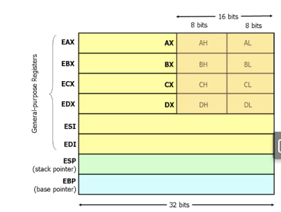

## compiling ([gcc compiler](https://gcc.gnu.org/onlinedocs)) 

1. preprocessing
2. compilation
3. assembly
4. linking

## preprocessing

start by interpreting (`gcc –E example.c`) statements that stard with `#`. for example
```c
#include <stdio.h>

#define MAX(x, y) ((x) > (y) ? (x) : (y))

int main() {
    int a = 5, b = 10;
    int max = MAX(a, b);
    printf("The maximum of %d and %d is %d\n", a, b, max);
    return 0;
}
```
becomes
```c
# 1 "example.c"
# 1 "<built-in>"
# 1 "<command-line>"
# 1 "example.c"

int main() {
    int a = 5, b = 10;
    int max = ((a) > (b) ? (a) : (b));
    printf("The maximum of %d and %d is %d\n", a, b, max);
    return 0;
}
```

## to assembly instructions
transforms the preprocessed code in assembly

```asm
    .file   "example.c"
    .section    .rodata
.LC0:
    .string "The maximum of %d and %d is %d\n"
    .text
    .globl  main
    .type   main, @function
main:
.LFB0:
    .cfi_startproc
    pushq   %rbp
    .cfi_def_cfa_offset 16
    .cfi_offset 6, -16
    movq    %rsp, %rbp
    .cfi_def_cfa_register 6
    subq    $32, %rsp
    movl    $5, -20(%rbp)
    movl    $10, -16(%rbp)
    movl    -20(%rbp), %eax
    cmpl    -16(%rbp), %eax
    jle .L2
    movl    -20(%rbp), %eax
    jmp .L3
.L2:
    movl    -16(%rbp), %eax
.L3:
    movl    %eax, -4(%rbp)
    movl    -20(%rbp), %eax
    movl    -16(%rbp), %edx
    movl    -4(%rbp), %ecx
    movl    $.LC0, %eax
    movl    %eax, %esi
    movl    $0, %eax
    call    printf
    movl    $0, %eax
    leave
    .cfi_def_cfa 7, 8
    ret
    .cfi_endproc
.LFE0:
    .size   main, .-main
    .ident  "GCC: (GNU) 9.3.0"
    .section    .note.GNU-stack,"",@progbits
```
## from assembly is generated the object/machine code

gcc -c exampple.c

## linking
in the last phase multiple object code is combined in one executeble gcc -o programm example.o example2.o

### static vs dynamic linking
**static link**
- self contained binaries and do not depend of external libraries

**dinamic link**
- binaries rely on system libraries that are loaded when needed
- maechnisms are needed to dynamically relocate code

## ELF (executable and linkable format)

- common for object files
  - `relocatable files`: contain code and data that can be linked with oter object files to create **executable** or shared object file
  - `executable files`: holding a program sutable for execution
  - `shared object files`
    - linked with other relocatable and shared object files to obtain anotehr object file
    - used by a **dynamic linker** together with other executable files to create a **process image**

### elf structure
- `elf header`: describes the file content
- `program header table`: info on how to create process image
- `sections 1..n`: sections needed for linking (instructions, data, symbol table, relocation information ...)
- `section header table`: description of previois sectins
  - `.text section`: contains the executable instructions of the programm
  - `.bss:` containded uninitialized data used to muild programms memory image
  - `.data, .data1:` contain initialized data
  - `.rodata, .rodata1`: references to read-only data
  - `.symtab:` contains the program's symbol table
  - `dynamic:` provides linking information

## x86 architecture

### x86 instruction set
- **movment insturctions**
  - `mov op1, op2`: copies op1 in location of op2 (mem location or register)
  - `rush op1:` places op1 onto the top of the stak
  - `pop op1`
  - `lea op1, op2`: load the memory addres indicated by op3 into the register op1
- **control flow insturctions**
  - `jmp op`: jump to the instruction at the memory location op
  - `cmp op1, op2`: compares the values of the two op and stores the result in the machine stats word
  - `j<conditikon> op`: depending on the condition and on the context of the machine status word, jumps to location op

- ESP... stak pointer
- EBP... base pointer  
- all other are general purpus

## Memory management

modern programming languages allow **data types** whitout having to know how they are represeted

programmers ignore where data s stored


compiler makes decisons, however at runtime allocation is under the controll of the OS and CPU

the stak rapresents functuion calls and are automaticly dealocated when the function returns